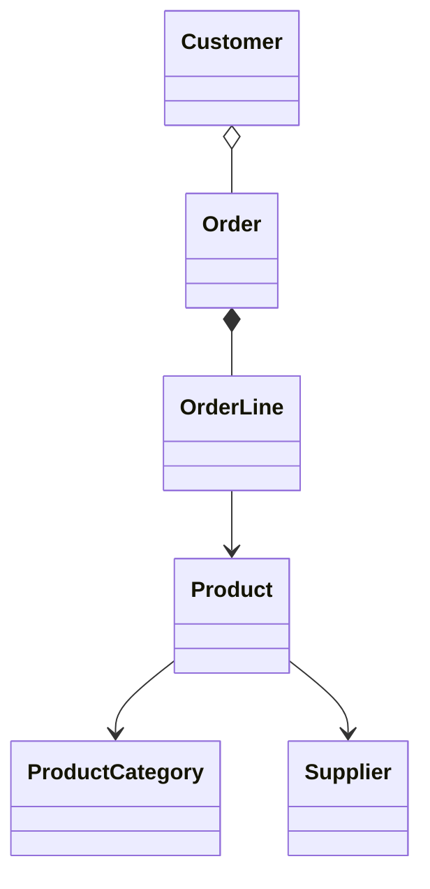
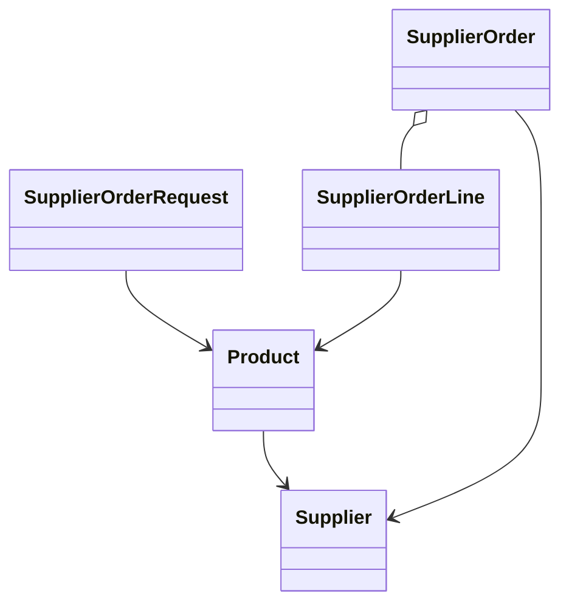
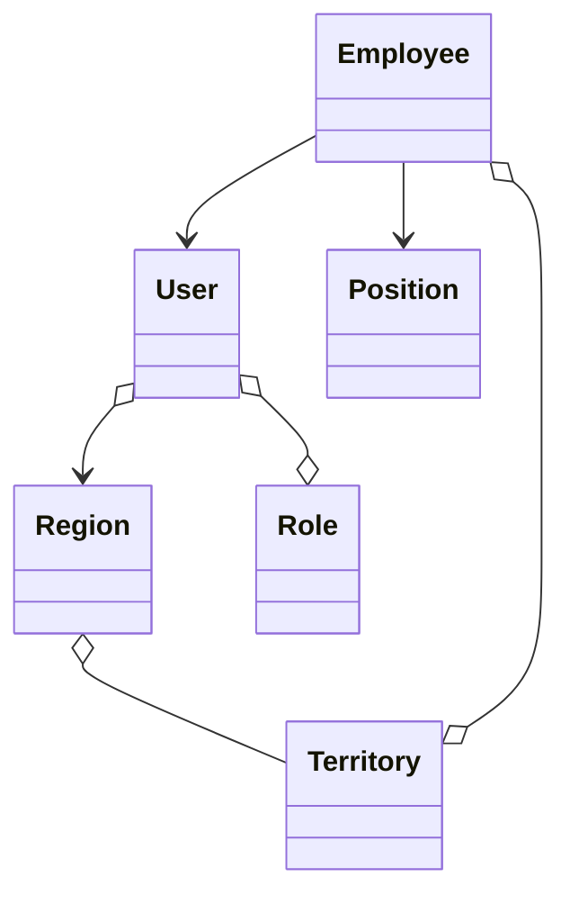

<p align="center">
  
</p>

# Jmix Bookstore

Jmix Bookstore is a comprehensive example application built with [Jmix](https://jmix.io/) - A Full-Stack Framework for Business Applications. It implements the use-cases of a retail business that focuses on shipping books throughout the US.


### Table of Content

- [Example Application](#example-application)
   * [About the Example](#about-the-example)
   * [Add-ons](#add-ons)
   * [Running with Trial Subscription](#running-with-trial-subscription)
   * [Online Demo](#online-demo)
- [Application Overview](#application-overview)
- [Business Functionality](#business-functionality)
   * [Sales](#sales)
      + [Placing Customer Orders](#placing-customer-orders)
   * [Order Fulfillment](#order-fulfillment)
      + [Confirming Customer Orders](#confirming-customer-orders)
      + [Perform Fill-up requests](#perform-fill-up-requests)
   * [Procurement](#procurement)
      + [Place Supplier Orders](#place-supplier-orders)
      + [Managing Product Catalog](#managing-product-catalog)
   * [IT](#it)
      + [Managing System Access](#managing-system-access)
      + [Master data management](#master-data-management)
- [Implementation](#implementation)
   * [Domain Model](#domain-model)
   * [Security](#security)
   * [Internationalization - I18n](#internationalization---i18n)
   * [Multitenancy](#multitenancy)
   * [BPM](#bpm)
   * [Email](#email)
   * [Reports](#reports)
   * [Notifications](#notifications)
   * [Background Tasks: Quartz](#background-tasks-quartz)


## Example Application

Jmix Bookstore is a retail bookstore, that ships books to customers. The single distribution channel is phone. Customers call in and can order books directly from the phone, without any need to use a computer. They simply speak to a person that takes their orders and makes sure the correct book lands at their doorsteps.

### About the Example

The Jmix Bookstore example application is a comprehensive example of what advanced capabilities Jmix provides for application developers. Compared to the [Jmix Petclinic](https://github.com/jmix-framework/jmix-petclinic) example application, the Bookstore is way bigger, covers more advanced use-cases and shows the capabilities of various add-ons (free as well as premium) and their integration into a Jmix application.

### Technical Details

Jmix Bookstore runs with the following technical characteristics:

* Jmix 1.4
* Spring Boot 2.7
* Java 17

The UI of the Bookstore is implemented using Jmix Classic UI. Flow UI Implementation will follow.

#### Application Size

To give an understanding of the size of the application, here are some rough statistics:

* 20 Entities
* 8 Enums
* 36 UI Screens
* 6 user roles
* 10 business processes

#### Production Code
* 150 Java classes
* 14.000 lines of code (Java + XML)

#### Test Code (rough statistics)
* 100 Test cases
* 130 Java classes (Test + Test support)
* 6.000 lines of code


### Implementation Effort

One important decision factors for implementing custom software is time to market / developer efficiency. Jmix aims to provide a fast way of delivering high quality backoffice style applications.

The Implementation of the version 1.0 of the Bookstore example was done in a _1.5 person-months_ by a single senior Java developer containing the following areas:

* conceptual meetings (5%)
* requirements gathering (5%)
* domain modelling (10%)
* data model implementation (10%)
* custom business logic implementation (15%)
* test automation (20%)
* UI development (20%)
* UI styling / theming (10%)
* documentation (5%)

Besides this little overall effort, the resulting application of the Jmix Bookstore has the following important characteristics:

1. high resulting quality (test automation, modularisation)
2. long term maintainable (due to test automation, modularisation, widely used base technologies like [Spring Boot](https://spring.io/projects/spring-boot), [JPA](https://jakarta.ee/specifications/persistence/) and [Vaadin](https://vaadin.com/))
3. good (out-of-the-box) user experience
4. broad functionality coverage
5. extensible for users without development effort (like custom filter selection, user-created reports, user-created BPM processes)

### Add-ons

The application is also a show-case application for multiple add-ons from the [Jmix Marketplace](https://www.jmix.io/marketplace). Jmix Bookstore uses the following add-ons:

* Multitenancy
* Email
* Reports
* Data Tools
* Quartz
* BPM (commercial)
* Notifications (commercial)
* Maps (commercial)

### Running with Trial Subscription

The application uses commercial add-ons, so you need an active subscription to run the app. If you have a trial subscription and want to run the Bookstore application locally, you may achieve this by a few simple steps. 

First, get the `jmix-commercial-addons-demo` sample application. You may download it from your account page at https://store.jmix.io/.

Next, copy the `trial-repository` directory from the `jmix-commercial-addons-demo` sample project to the root of the `jmix-bookstore` project.

After that modify the `build.gradle` file of the `jmix-bookstore` project: add the repository with the `trial-repository` directory.

```
repositories {
    mavenCentral()
    maven {
        url 'https://global.repo.jmix.io/repository/public'
    }
    if (file('trial_repository').exists()) {
        maven {
            url "file://${project.projectDir}/trial_repository"
        }
    } else {
        maven {
            url = 'https://global.repo.jmix.io/repository/premium'
            credentials {
                username = rootProject['premiumRepoUser']
                password = rootProject['premiumRepoPass']
            }
        }
    }
}
```

Keep in mind that the Bookstore sample must be based on exactly the same Jmix version as a commercial add-ons sample.

### Online Demo

The demo of the Jmix Bookstore is available at [demo.jmix.io/bookstore](https://demo.jmix.io/bookstore).

The following users are available:

| Position                     | Username | Password |
|------------------------------|----------|----------|
| Order Fulfillment Manager    | adrian   | adrian   |
| Order Fulfillment Specialist | hikari   | hikari   |
| Order Fulfillment Specialist | melissa  | melissa  |
| Procurement Manager          | nicole   | nicole   |
| Procurement Specialist       | sophia   | sophia   |
| Procurement Specialist       | william  | william  |
| Sales Representative         | lois     | lois     |
| Sales Representative         | jessica  | jessica  |
| Administrator                | admin    | admin    |

## Application Overview


After logging in as `admin` the application provides UIs for managing Customers, Orders, Products and associated master data like Employees.

At the top menu, there is an icon for the current tasks of the user as well as unread notifications.

## Business Functionality

The Jmix Bookstore application supports all departments in their use-cases. The company contains of the following departments:

* Order Fulfillment
* Procurement
* Sales
* IT

We will highlight the main business cases of the corresponding departments that are supported by the application.

### Sales

The sales team is the main interaction point with the customers. The customer calls to place an order. The sales employees are taking over this responsibility. The company splits the customers into different territories. Each sales team member is then responsible for one or more territories:

* `Lois Marsh` responsible for all territories in regions "US-South" and "US-East".
* `Jessica Musgrave` responsible for all territories in the regions "US-North" and "US-West".

#### Placing Customer Orders


When a customer calls and wants to order some books, the order fulfillment specialists us the ability of the system to place orders. They search for the customers by first name / lastname and optionally create a customer record for new customers.


After that, they collect the books that the customer would like to order, the quantity and let the customer know about the price of a particular book and the overall order.

Placed orders will be picked up by the order fulfillment employees to confirm the customer order (see: [Order Fulfillment > Confirming Customer Orders](#confirming-customer-orders)). When an order is confirmed by their colleges, the sales employee gets a notification to keep track of which orders need further clarification or where the customer needs to be contacted (see: [Functionalities > Notifications](#notifications)).


### Order Fulfillment

The order fulfillment department consists of three employees: `Melissa Arendt` and `Hikari Miyama` as order fulfillment specialists as well as `Adrian Adams` being a order fulfillment manager.

They together are responsible for making sure the orders, created by the sales folks are correct and can be fulfilled. Sometimes they see that particular books are low in stock. So they indicate to the procurement department that a book is getting out-of-stock, so that the colleges can order new books from the suppliers.

#### Confirming Customer Orders

Once the order is placed by the sales department, it needs to be confirmed by the fulfillment employees. During the confirmation, the distribution center that should fulfill the order is selected. The system gives recommendations, but ultimately it is up to the order fulfillment specialist to decide which is the distribution center that fulfills the order. The main decision factor is the proximity between the fulfillment center and the shipping address, but other factors like amount of stock is also considered.


#### Perform Fill-up requests

After a customer placed an order, the order fulfillment specialist checks about the remaining amount of stock for a book. In case it goes below a threshold, they will request a fill-up for this book in the inventory. During that process, the procurement employees are notified (see: [Functionalities > Notifications](#notifications)), so that they can start the work on performing supplier orders.


### Procurement

The employees of the procurement department are: `William Linville` and `Sophia Burnett`. `Nicole Berry` is their manager.

The responsibility of the procurement team is to perform supplier orders to fill up the stock of books. Besides that they are also in charge of managing the book catalog.

#### Place Supplier Orders

When a fill-up requests comes from the order fulfillment employees, William and Sophia are supposed to trigger a supplier order. They normally do that on mondays. Over the week the system collects the fill-up requests and groups them by suppliers, so that an aggregated supplier order can be placed.


The procurement specialist reviews the aggregated requests and can potentially make adjustments regarding the total amount of books or adding / removing particular books from the supplier order.


Once the review is finished, sometimes an approval is required. The system decides based on cooperation status with that supplier if the order is send for approval to the procurement manager.


This business process is implemented using the BPM add-on (see: [Functionalities > BPM](#BPM)).

Finally, after optionally approving the supplier order, a supplier order is placed. The system sends out an automated email containing all relevant information to the configured supplier email address. (see: [Functionalities > Email](#email)).


#### Managing Product Catalog

The second responsibility is to manage the product catalog of books. For this the procurement employees the application provides UIs to add books to the product catalog as well as removing them from the listing.


### IT

The IT department of the company consists of a single person: `Mike Holloway`. He is taking care of managing the master data of the system as well as providing system access for employees.

#### Managing System Access

In order to ensure that every employee has access to the system functionalities they need in order to fulfill their duties, Mike empowers employees to have access to the system. For this he manages employee records and users. He also assigns them to the corresponding positions & roles in the company and optionally their associated territories. With that, the employees are able to access the parts of the system and the associated data.

As (data) security is a very important to the company, the data the employees see is strictly restricted to their area of work. E.g. sales employees can only see customers and orders of their associated territories. Additionally, they are only allowed to create orders and customers, but not products or territories. This role management and assignment is performed by Mike as his work as the IT administrator.


#### Master data management

Particular data that changes very infrequent and acts as master data for other parts of the system is also managed by the IT department. This includes the Regions, Territories as well as the fulfillment centers the company operates.


## Implementation

This section describes different functionalities that are part of the Jmix Bookstore application and also how they implemented using different capabilities of Jmix.

### Domain Model

The domain model of the Jmix Bookstore is based on a regular order management system's data model. Additionally, it contains the part for the supplier order process and the general HR domain model.

The domain model for the customer orders part looks like this:



A `Customer` are associated to many orders. An `Order` consists of multiple `OrderLine` objects. One `OrderLine` represents a product association with corresponding information about the price. The `Product` entity is grouped into `ProductCategory` entities and references a `Supplier` that is used to request supplier orders.

The domain model that supports the supplier orders contains of the following entities:



The `Product` entity is the source entity, that acts as the basis for `SupplierOrderRequest` instances. Those are created during the [Perform Fill-up requests](#perform-fill-up-requests) process. The system converts those requests into `SupplierOrder` entities which hold a `SupplierOrderLine` for each `SupplierOrderRequest` that referenced a `Product` which belongs to the same `Supplier`. This `Supplier` is also used for the `SupplierOrder`.

During the [Place supplier orders](#place-supplier-orders) process, those `SupplierOrder` entities are created. The `Employee` that reviewed this `SupplierOrder` (through the BPM process variables) brings up the next subpart of the domain model. 

The part of the employee information with the corresponding territory associations looks like this:



An `Employee` represents the logical representation of an employee in the company. The `Employee` has a `Position` that (s)he holds within the organisation. Optionally the `Employee` can reference multiple `Territory` instances, that (s)he is responsible for. Those `Territory` entities are grouped into a `Region`.

The system representation of an employee is the `User`, which main purpose is proving system access. The `User` references multiple `Role` entities (not physically in the database, just conceptually via the `RoleAssignmentEntity` from Jmix). 

Additionally, the `User` references multiple `Region` entities as "associated regions". Those regions are automatically determined by the fact that the `Employee` has multiple `Territories` assigned, which themselves belong to a `Region`. This reference is present to allow the row-level roles to restrict access to Customers / Orders of the same region that the current user is in (see: [Security > row-level roles](#security)).

### Security

The Bookstore example uses different permissions for the different user groups to ensure users can only see the data and use the functionality they need for their daily work.

The Jmix Subsystem is used to achieve this goal. In the [io.jmix.bookstore.security](https://github.com/jmix-framework/jmix-bookstore/tree/main/src/main/java/io/jmix/bookstore/security) package, there are different design-time roles are defined.

The employees generally obtain one of the following functional / resource roles:

* `EmployeeRole` - base role for all employees to get basic system access
  * read permission for master data like employees, position, tenants
  * UI permissions for common UI screens like 'My Task List', 'Address Map Lookup UI', etc.
* `FullAccessRole` - Role for administrative users without any restrictions
* `OrderFulfillmentRole` - functional role for `Order Fulfillment` position
  * read & write access to Customer & Order data; supplier order requests
  * read access to Product and supplier order data
  * access to corresponding UI screens
* `ProcurementSpecialistRole`- functional role for `Procurement Specialist` position
    * read & write access to product catalog data
    * read & write access to supplier order data
    * read access to supplier order request data
    * write access to supplier order request _status_ attribute
    * access to corresponding UI screens
* `ProcurementManagerRole`- functional role for `Procurement Manager` position
  * read & write access to product catalog data
  * read & write access to supplier order data
  * read access to supplier order request data
  * access to corresponding UI screens
* `SalesRepresentativeRole`- functional role for `Sales Representative` position
  * read & write access to Customer & Order data; supplier order requests
  * read access to product catalog data
  * access to corresponding UI screens

Additionally, there are two data constraining roles / row-level roles present in the system:

* `ShowOnlyActiveSuppliersRole`- data constraining role for `Procurement Specialist` position
    * limits Suppliers to only ones that are not in status 'On Hold'
    * limits Products to only ones that have Suppliers with status not in 'On Hold'
* `ShowOnlyActiveSuppliersRole`- data constraining role for `Order Fulfillment` and `Sales Representative` position
    * limits customers to only ones that are in the associated regions of the current employee
    * limits orders to only ones where the customers region is in the associated regions of the current employee

The Jmix Security subsystem (see [Jmix Documentation: Security](https://docs.jmix.io/jmix/security/index.html)) takes those design time roles into consideration automatically when users are assigned to those roles.

This assignment happens as part of the test data creation in the case of the Bookstore example, or during runtime in case an administrator manually manages system access (see [IT > Managing System Access](#managing-system-access)).

For automatic provisioning of the role assignments see the following classes:

* [ItAdministratorEmployeeDataProvider](https://github.com/jmix-framework/jmix-bookstore/blob/main/src/main/java/io/jmix/bookstore/test_data/data_provider/employee/ItAdministratorEmployeeDataProvider.java)
* [ProcurementManagerDataProvider](https://github.com/jmix-framework/jmix-bookstore/blob/main/src/main/java/io/jmix/bookstore/test_data/data_provider/employee/ProcurementManagerDataProvider.java)
* [OrderFulfillmentSpecialistDataProvider](https://github.com/jmix-framework/jmix-bookstore/blob/main/src/main/java/io/jmix/bookstore/test_data/data_provider/employee/OrderFulfillmentSpecialistDataProvider.java)
* [ProcurementManagerDataProvider](https://github.com/jmix-framework/jmix-bookstore/blob/main/src/main/java/io/jmix/bookstore/test_data/data_provider/employee/ProcurementManagerDataProvider.java)
* [ProcurementSpecialistDataProvider](https://github.com/jmix-framework/jmix-bookstore/blob/main/src/main/java/io/jmix/bookstore/test_data/data_provider/employee/ProcurementSpecialistDataProvider.java)
* [SalesRepresentativeDataProvider](https://github.com/jmix-framework/jmix-bookstore/blob/main/src/main/java/io/jmix/bookstore/test_data/data_provider/employee/SalesRepresentativeDataProvider.java)

### Internationalization - I18n

Jmix supports the application to be available in different languages. The Jmix Bookstore is translated into different languages (English and German at the moment). The user can select the desired language on the login screen.

#### Static Translations

In the UI, the texts to display are referenced through the `msg://` prefix, together with a translation key like: `io.jmix.bookstore.employee.territory.screen/territoryBrowse.caption`. For each language, there is a translation file that contains the mappings between those keys and the translated text. See [messages_de.properties](https://github.com/jmix-framework/jmix-bookstore/blob/main/src/main/resources/io/jmix/bookstore/messages_de.properties) for the german translation.

#### Translation of data

Sometimes it is also required to not only change the static part of the application (like UI Labels, Error messages, Enum Values), but also to allow users to dynamically enter translations for data that is used as reference data e.g.

This form of translation is not supported out of the box by Jmix. Instead, it requires the application developer to implement a solution for the concrete use-case.

In the Bookstore example, we have implemented one example of such behaviour. There is an entity called `Position` which allows the administrator to configure the different Positions that are available for employees. The name of that Position (like `Sales Representative`) should be translated to the different languages. This way when the administrator creates the employee, it is possible to see the translated term for the entry in the dropdown box of the position selection.

It is implemented in the following way. The `Position` entity holds a 1:N composition to an entity called `PositionTranslation` that is used to store the translations. The `PositionTranslation` entity has the following attributes:

* name (the translated value)
* locale (the language the value represents)
* position (the position it belongs to)

There are standard UIs for the management of the translations generated as part of the Position editor screen. To display the correct translation on the dropdown, the instance name of the `Position` entity contains a lookup for the translation of the current user: 


```java
class Position {
    // ...

    @OnDelete(DeletePolicy.CASCADE)
    @Composition
    @OneToMany(mappedBy = "position")
    private List<PositionTranslation> translations;

    @InstanceName
    @DependsOnProperties({"name", "translations"})
    public String getInstanceName(CurrentAuthentication currentAuthentication) {
        Locale currentLocale = currentAuthentication.getLocale();
        return translations.stream().filter(positionTranslation -> positionTranslation.getLocale().equals(currentLocale))
                .map(PositionTranslation::getName)
                .findFirst()
                .orElse(getName());
    }
}
```

The `CurrentAuthentication` dependency passed into the method allows to retrieve the current locale of the user.

See the following classes that represent the described behaviour:
* [Position](https://github.com/jmix-framework/jmix-bookstore/blob/main/src/main/java/io/jmix/bookstore/employee/Position.java) - The entity that should have translation for the name
* [PositionTranslation](https://github.com/jmix-framework/jmix-bookstore/blob/main/src/main/java/io/jmix/bookstore/employee/PositionTranslation.java) - The entity that holds the translations of a Position 
* [LocaleConverter](https://github.com/jmix-framework/jmix-bookstore/blob/main/src/main/java/io/jmix/bookstore/entity/datatypes/LocaleConverter.java) - Converter to store `java.util.Locale` instances directly in the DB
* [LocaleDatatype](https://github.com/jmix-framework/jmix-bookstore/blob/main/src/main/java/io/jmix/bookstore/entity/datatypes/LocaleDatatype.java) - Jmix Datatype definition of `java.util.Locale`
* [PositionEdit](https://github.com/jmix-framework/jmix-bookstore/blob/main/src/main/java/io/jmix/bookstore/employee/position/screen/PositionEdit.java) - Position Edit Screen that converts the `Locale` instance to a proper name via `MessageTools` (e.g.: `de` will translate to `German`)

### Multitenancy

In the bookstore example the [Multitenancy add-on](https://www.jmix.io/marketplace/multitenancy/) is used to provide the different users ephemeral test environments of the bookstore. This is mainly used for the hosted version at [https://demo.jmix.io/bookstore](https://demo.jmix.io/bookstore) to prevent cluttered test data from various users when trying out the bookstore online demo. In this application, the Multitenancy add-on is used is the following:

All business entities (Customer, Order, Product, etc.) have an attribute `tenant` annotated with `@TenantId` through the superclass `StandardTenantEntity`.

As for the test environment use-case of the Multitenancy usage it is needed to store additional data on the tenant entity. This is achieved by using Jmix extension mechanism. The entity [TestEnvironmentTenant](https://github.com/jmix-framework/jmix-bookstore/blob/main/src/main/java/io/jmix/bookstore/multitenancy/TestEnvironmentTenant.java) extends the `Tenant` entity that comes from the add-on. It uses `@ReplaceEntity(Tenant.class)` to indicate to Jmix that this entity should be used throughout the application instead of the original `Tenant` entity class.

See also: [Jmix Documentation: 
Modularity and Extension / 
Extending Functionality / Extending Data Model](https://docs.jmix.io/jmix/modularity/extension.html#data-model).

When the user opens the app for the first time, a random tenant identifier is generated like `test-b39b7f` and put into the Tenant ID field in the Login screen:


When logging in and the tenant is not already initialised in the DB, the following operations are performed:

1. Tenant is created
2. Tenant `admin` user is created
3. all example business users are created
4. system data (BPM process definition, System Reports) are imported for the tenant
5. master data (Employee Positions, Regions, Territories, etc.) are created
6. random test data for all business entities are generated

See the following classes that represent the described behaviour: 
* [TestEnvironmentTenants](https://github.com/jmix-framework/jmix-bookstore/blob/main/src/main/java/io/jmix/bookstore/multitenancy/TestEnvironmentTenants.java) - Interface providing the main API of the test environment tenant logic
* [TestEnvironmentTenantsBean](https://github.com/jmix-framework/jmix-bookstore/blob/main/src/main/java/io/jmix/bookstore/multitenancy/TestEnvironmentTenantsBean.java) - Bean implementing `TestEnvironmentTenants` interface
* [TenantCreation](https://github.com/jmix-framework/jmix-bookstore/blob/main/src/main/java/io/jmix/bookstore/multitenancy/test_environment/TenantCreation.java) - Bean for creating the tenant instance
* [TestDataCreation](https://github.com/jmix-framework/jmix-bookstore/blob/main/src/main/java/io/jmix/bookstore/test_data/TestDataCreation.java) - Bean for generating / importing test data
* [TenantTestdataIntegrationTest](https://github.com/jmix-framework/jmix-bookstore/blob/main/src/test/java/io/jmix/bookstore/test_environment/tenant/TenantTestdataIntegrationTest.java) - Integration test that shows how the tenant / test data generation works (only business logic, not UI)

### BPM

The [BPM add-on](https://www.jmix.io/marketplace/bpm/) is used by the Bookstore application to implement business processes using the BPMN standard. It embeds the flowable BPMN engine into the application and provides UIs for task management.

The business process where the BPMN engine is used is: [Place Supplier Orders](#place-supplier-orders). The process definition can be seen in the running application as well as in the source code representation (either via XML or through the BPMN Designer of Jmix Studio (see also: [Jmix Documentation:  Using Studio / Studio Features / BPMN Designer](https://docs.jmix.io/jmix/studio/bpmn-designer.html)).


See also: [perform-supplier-order.bpmn20.xml](https://github.com/jmix-framework/jmix-bookstore/blob/main/src/main/resources/processes/perform-supplier-order.bpmn20.xml)

The process contains the following tasks:

1. `Review Supplier Order Draft` - human task to look at the created draft (based on the fill-up requests) and decide to continue with the order or decline the order all together
2. `Draft valid?`
   1. if invalid, the order is marked as invalid and the requester are notified about the invalidity of their request
   2. if valid, the order is marked as valid
3. `Approval required decision` (DMN Task) - DMN table that identifies under which circumstances a valid order needs to go to approval (based on the supplier cooperation status)
4. `Approval required?`
   1. if required, human task to approve supplier order (with optional feedback loop to the `Procurement Specialist`) is performed by the `Procurement Manager`
   2. if not required, the order is placed
5. `Place Supplier Order` - Service Task to automatically place the order. It marks the order as placed and creates a Microsoft Word document via [Jmix Reports Integration](#reports) containing the order with its line items as a letter. The rendered word document is stored on the supplier order entity and returned to the process instance to use it in the next step.
6. `Send Order Form to Supplier` - Email task that sends out the generated order form via Email to the corresponding supplier through [Jmix Email integration](#email).

The process is programmatically triggered as part of the scheduled task 'Supplier Order Draft Creation', where for each new draft a BPMN process is started and assigned to users with the role `Procurement Specialist`.

See the following classes that are related to the BPM usage:

* [perform-supplier-order.bpmn20.xml](https://github.com/jmix-framework/jmix-bookstore/blob/main/src/main/resources/processes/perform-supplier-order.bpmn20.xml) - The BPMN process definition for the `perform supplier order` process
* [PerformSupplierOrderService](https://github.com/jmix-framework/jmix-bookstore/blob/main/src/main/java/io/jmix/bookstore/product/supplier/bpm/PerformSupplierOrderService.java) - Interface representing the logic that is called during the BPMN service tasks
* [PerformSupplierOrderServiceBean](https://github.com/jmix-framework/jmix-bookstore/blob/main/src/main/java/io/jmix/bookstore/product/supplier/bpm/PerformSupplierOrderServiceBean.java) - Bean that implements `PerformSupplierOrderService` and provides logic to notify requesters about invalid requests as well as placing the supplier order on the supplier system
* [SupplierOrderDraftCreation](https://github.com/jmix-framework/jmix-bookstore/blob/main/src/main/java/io/jmix/bookstore/product/supplier/creation/SupplierOrderDraftCreation.java) - Bean that creates the process instances based on the supplier order drafts it creates
* [SupplierOrderReview](https://github.com/jmix-framework/jmix-bookstore/blob/main/src/main/java/io/jmix/bookstore/product/supplier/screen/supplierorder/SupplierOrderReview.java) - Custom UI screen that implements the human task of the process to review the requested supplier order
* [SupplierOrderApproval](https://github.com/jmix-framework/jmix-bookstore/blob/main/src/main/java/io/jmix/bookstore/product/supplier/screen/supplierorder/SupplierOrderApproval.java) - Custom UI screen that implements the human task of the process to approve a supplier order

### Email

As the last step of the [Place Supplier Orders](#place-supplier-orders) business process, the BPM business process integrates the [Email add-on](https://www.jmix.io/marketplace/email-sending/) into the process. The supplier order form is send to the supplier via Email. For sending out the Email the add-on is the responsible component.

Besides adding the add-on to the `build.gradle` it is required to configure the connection settings to the SMTP server in the `application.properties`:

````groovy
// ...
dependencies {
    // ...
    implementation 'io.jmix.email:jmix-email-starter'
    implementation 'io.jmix.email:jmix-email-ui-starter'
}
````

```properties
# ...

##############################################################
# Jmix Email Add-on
##############################################################
jmix.email.email-sending-cron=*/30 * * * * ?

jmix.email.from-address=<<MAIL_SERVER_HOST>>

# Spring Mail configuration
spring.mail.properties.mail.smtp.starttls.enable=true
spring.mail.properties.mail.smtp.auth=true
spring.mail.protocol=
spring.mail.port=
spring.mail.host=<<MAIL_SERVER_HOST>>
spring.mail.username=<<MAIL_SERVER_USERNAME>>
spring.mail.password=<<MAIL_SERVER_PASSWORD>>
```

The add-on comes with an administrative UI to see what the status is of outgoing Emails. It contains the ability to read the emails, download the attachments and trigger re-send in case something went wrong during transmission.


### Reports

The Reports [add-on](https://www.jmix.io/marketplace/reports/) is used in the Bookstore example as part of the [Place Supplier Orders](#place-supplier-orders) BPM process. When the order is placed, the supplier order form (as Microsoft Word document) is created. To achieve this, the Report `Supplier Order Form` is configured via the administrative UI:


The Report contains a report template as a Word document that contains placeholders where the actual data is inserted.

To contain the correct data (supplier order, order lines), the corresponding data from the BPM process is passed in when the report execution is triggered. This happens within the Service task `Place Supplier Order` implemented in [PerformSupplierOrderServiceBean](https://github.com/jmix-framework/jmix-bookstore/blob/main/src/main/java/io/jmix/bookstore/product/supplier/bpm/PerformSupplierOrderServiceBean.java) through the `ReportRunner` API from the reports add-on (see also: [Jmix Documentation: Add-ons / Reports / Running Reports / Reports API](https://docs.jmix.io/jmix/reports/run-report.html#reports-api)):

```java
class PerformSupplierOrderBean {
    
    // ...
    private FileRef createSupplierOrderForm(User reviewedBy, SupplierOrder reloadedSupplierOrder) {
        ReportOutputDocument document = reportRunner.byReportCode("supplier-order-form")
                .addParam("entity", reloadedSupplierOrder)
                .addParam("reviewedBy", reviewedBy)
                .run();

        ByteArrayInputStream documentBytes = new ByteArrayInputStream(document.getContent());
        return fileStorage.saveStream("supplier-order-form.docx", documentBytes);
    }
}
```

### Notifications

The Bookstore example utilises the [notifications add-on](https://www.jmix.io/marketplace/notifications/) to notify business users about events that happened within the system. In the users inbox, those notifications can be reviewed and marked as read.


The Bookstore notifies about the following business events:

| Business Process                                          | Business Event                 | Sender                       | Receiver               |
|-----------------------------------------------------------|--------------------------------|------------------------------|------------------------|
| [Confirming Customer Orders](#confirming-customer-orders) | Order confirmed                | Order Fulfillment Specialist | Sales                  |
| [Perform Fill-up requests](#perform-fill-up-requests)     | Supplier Order Request created | Order Fulfillment Specialist | Procurement Specialist |
| [Place Supplier Orders](#place-supplier-orders)           | Supplier Order Draft created   | System                       | Procurement            |

The notifications are send out by the system as part of state transitions of entities. Generally it uses the `NotificationManager` API from the notifications add-on to deliver the in-app notifications to the users. See [NotificationCenter](https://github.com/jmix-framework/jmix-bookstore/blob/main/src/main/java/io/jmix/bookstore/notification/NotificationCenter.java).

In the bookstore example an additional abstraction is implemented. The Notification Center is the main class responsible for sending out the in-app notifications. It listens to all Spring events of type [InAppNotificationSource](https://github.com/jmix-framework/jmix-bookstore/blob/main/src/main/java/io/jmix/bookstore/notification/InAppNotificationSource.java). This means that within the application the Spring application events mechanism is used to produce custom events at various points in the application.

Here is an example of the event interaction from the [Order Fulfillment > Confirming Customer Orders](#confirming-customer-orders) process for sending out an in-app notification:


The data (sender, receiver, title and text) for the corresponding Events of type `InAppNotificationSource`
are provided by implementing a bean of type `NotificationDetailDataProvider<OrderConfirmedEvent>`. For the Order Confirmation example from above the following bean implements this responsibility: [OrderConfirmedNotificationDetailDataProvider](https://github.com/jmix-framework/jmix-bookstore/blob/main/src/main/java/io/jmix/bookstore/order/notification/OrderConfirmedNotificationDetailDataProvider.java).

The `NotificationCenter` finds the corresponding data provider bean that match a particular event type to retrieve the notification data.

### Background Tasks: Quartz

In the Bookstore example the [Quartz add-on](https://www.jmix.io/marketplace/quartz/) is used to run periodic tasks by the system. Mainly the following two scheduled tasks are implemented:

* Create supplier order drafts (as part of the [Place Supplier Orders](#place-supplier-orders) process) every 5 minutes
* Clean up old test data tenants that are no longer in use (every day)

Example: `SupplierOrderDraftCreation`:

For the scheduled task of the supplier order draft creation a Quartz Job is registered as a spring bean together with a trigger configuration
(see: [SupplierOrderDraftCreationConfig](https://github.com/jmix-framework/jmix-bookstore/blob/main/src/main/java/io/jmix/bookstore/product/supplier/creation/SupplierOrderDraftCreationConfig.java)):

```java
@Configuration
public class SupplierOrderDraftCreationConfig {

    @Bean
    JobDetail supplierOrderDraft() {
        return JobBuilder.newJob()
                .ofType(SupplierOrderDraftCreationJob.class)
                .storeDurably()
                .withIdentity("supplierOrderDraftCreation")
                .build();
    }

    @Bean
    Trigger supplierOrderDraftTrigger(JobDetail supplierOrderDraft) {
        return TriggerBuilder.newTrigger()
                .forJob(supplierOrderDraft)
                .withIdentity("supplierOrderDraftTrigger")
                .startNow()
                .withSchedule(
                        cronSchedule("0 0/5 * * * ?")
                )
                .build();
    }
}
```

This mechanism registers the Job `SupplierOrderDraftCreationJob` automatically in the system when the application starts up. In the quartz add-on it is also possible to configure those scheduled tasks via the UI. But in this example it is registered through source-code to show an alternative approach.

Here is the implementation of the Job class that is executed as part of this scheduled task: `SupplierOrderDraftCreationJob`:
````java
public class SupplierOrderDraftCreationJob implements Job {

    //...
    
    private final SupplierOrderDraftCreation supplierOrderDraftCreation;

    public SupplierOrderDraftCreationJob(SupplierOrderDraftCreation supplierOrderDraftCreation) {
        this.supplierOrderDraftCreation = supplierOrderDraftCreation;
    }


    @Override
    @Authenticated
    public void execute(JobExecutionContext context) {
        log.info("Starting Supplier Order Draft Creation Job for all Tenants");
        int amountOfCreatedSupplierOrders = supplierOrderDraftCreation.createDraftSupplierOrders();
        log.info("Finished Supplier Order Draft Creation Job: {} Supplier Orders created", amountOfCreatedSupplierOrders);
    }
}

````
(see: [SupplierOrderDraftCreationJob](https://github.com/jmix-framework/jmix-bookstore/blob/main/src/main/java/io/jmix/bookstore/product/supplier/creation/SupplierOrderDraftCreationJob.java)).

The class needs to implement the `org.quartz.Job` interface, but does not need to be marked as a Spring `@Component`.

The execution context is authenticated with system authentication via the `@Authenticated` annotation on the execute method. See also: [Jmix Documentation: Security / Authentication / System Authentication](https://docs.jmix.io/jmix/security/authentication.html#system).

The actual business logic of creating supplier order instances is implemented in the bean `SupplierOrderDraftCreation` to separate execution context from business logic.
